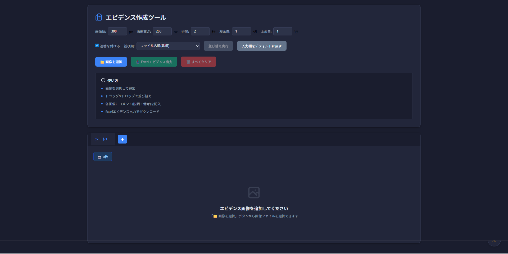

# エビデンス作成ツール

画像を整理してExcelでエビデンス資料を作成するためのWebアプリケーションです。

## 画面レイアウト
- ライトモード


- ダークモード


## 特徴

- 📑 タブによる複数シート管理
- 📁 複数画像の一括アップロード
- 🎨 ダークモード対応
- 🔄 ドラッグ&ドロップで画像を並び替え
- 💬 各画像にコメント追加
- 📊 Excel形式でエビデンス出力(複数シート対応)
- 🖼️ 画像のライトボックス表示
- ⚙️ カスタマイズ可能な画像サイズと配置
- ✏️ タブ名の編集機能

## セットアップ

### 前提条件

- Node.js 16以上

### インストール

```bash
# 依存関係のインストール
npm install

# 開発サーバーの起動
npm run dev

# プロダクションビルド
npm run build

```

## プロジェクト構造

```
src/
├── components/            # Vueコンポーネント
│   ├── TheHeader.vue     # ヘッダーとコントロール
│   ├── TabsContainer.vue # タブコンテナ
│   ├── ImageGrid.vue     # 画像グリッド
│   ├── ImageItem.vue     # 個別画像アイテム
│   ├── Toast.vue         # トースト通知
│   ├── Modal.vue         # モーダルダイアログ
│   └── ThemeToggle.vue   # テーマ切り替えボタン
├── composables/          # 再利用可能なロジック
│   ├── useToast.js       # トースト通知機能
│   ├── useTheme.js       # テーマ管理
│   └── useExcelExport.js # Excel出力機能
├── assets/
│   └── styles/
│       └── main.scss     # メインスタイル
├── App.vue               # ルートコンポーネント
└── main.js               # エントリーポイント
```

## 使い方

### 基本操作

1. **タブ管理**
   - 「+」ボタンで新しいタブ(シート)を追加
   - タブ名をダブルクリックで編集(最大31文字)
   - タブの「×」ボタンで削除(最後の1つは削除不可)

2. **画像管理**
   - 「📁 画像を選択」ボタンから画像ファイルを選択
   - ドラッグ&ドロップで画像を並び替え
   - 各画像にコメント(説明・備考)を記入
   - 画像クリックでライトボックス表示

3. **Excel出力**
   - 「📥 Excelエビデンス出力」でダウンロード
   - タブごとに別シートとして出力
   - タブ名がExcelのシート名になります

## 技術スタック

- **Vue 3**: Composition API
- **Vite**: ビルドツール
- **SCSS**: スタイリング
- **ExcelJS**: Excel生成
- **SortableJS**: ドラッグ&ドロップ
- **PhotoSwipe**: 画像ライトボックス

## カスタマイズ

### 画像設定
- **画像幅・高さ**: Excel出力時の画像サイズ(px)
- **行間**: 画像間のスペース(行数)
- **左余白**: Excelシートの左側の余白(列数)
- **上余白**: Excelシートの上側の余白(行数)
- **連番を付ける**: 画像に番号を付ける(有効時は上余白最小値1、A列に「No」ヘッダーを追加)

### 並び順オプション
- ファイル名順(昇順/降順)
- 更新日時順(新→古/古→新)
- ファイルサイズ順(大→小/小→大)

### その他機能
- **デフォルトに戻す**: すべての設定を初期値にリセット
- **すべてクリア**: 現在のタブの画像とコメントをすべて削除
- **ダークモード**: 右上のボタンでテーマを切り替え

## ライセンス

MIT
